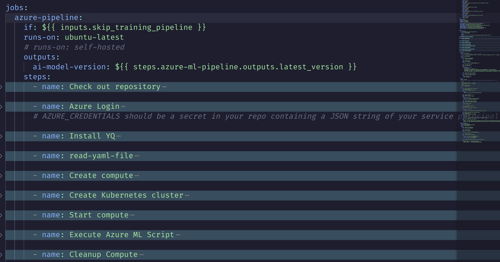

## Mushroom classification

# MLOps Project Report

(side note: I'm sorry if I went overboard with the project and the documentation.... I had a bit too much fun adding stuff once I got the hang of it.)

## Table of Contents

- [MLOps Project Report](#mlops-project-report)
  - [Table of Contents](#table-of-contents)
  - [1. Introduction](#1-introduction)
  - [2. Project Overview](#2-project-overview)
    - [2.1 Dataset](#21-dataset)
      - [2.1.1 Data upload](#211-data-upload)
    - [2.2 AI Model Selection](#22-ai-model-selection)
      - [2.2.1 Model decision](#221-model-decision)
    - [2.3 Data Preprocessing](#23-data-preprocessing)
      - [2.3.1 Data preparation for this specific dataset (done outside of the pipeline)](#231-data-preparation-for-this-specific-dataset-done-outside-of-the-pipeline)
      - [2.3.2 Data prep in the pipeline](#232-data-prep-in-the-pipeline)
      - [2.3.3 Target Label Extraction](#233-target-label-extraction)
      - [2.3.4 label Encoding](#234-label-encoding)
      - [2.3.5 feature Extraction](#235-feature-extraction)
  - [prerequisites](#prerequisites)
    - [Azure Credentials](#azure-credentials)
    - [GitHub Secrets](#github-secrets)
    - [Configurations](#configurations)
    - [Getting Started](#getting-started)
  - [3. Cloud AI Services](#3-cloud-ai-services)
    - [3.1 Compute Resource Management](#31-compute-resource-management)
    - [3.2 Environment Setup](#32-environment-setup)
  - [4. Model Training and Evaluation](#4-model-training-and-evaluation)
    - [4.1 Azure ML](#41-azure-ml)
    - [4.2 Model Training](#42-model-training)
    - [4.3 Model Evaluation](#43-model-evaluation)
      - [4.3.1 conclusions](#431-conclusions)
  - [5. Deployment](#5-deployment)
    - [5.1 Fast api Deployment](#51-fast-api-deployment)
    - [5.3 API Endpoints](#53-api-endpoints)
    - [5.4 Web App](#54-web-app)
    - [5.6 Gradio](#56-gradio)
    - [5.7 deployment on azure kubernetes !!! bonus, not necessary](#57-deployment-on-azure-kubernetes--bonus-not-necessary)
  - [6. Integration with Existing Software](#6-integration-with-existing-software)
    - [6.1 fake company](#61-fake-company)
    - [6.1.1 integration in an existing software system](#611-integration-in-an-existing-software-system)
  - [7. Automation and Version Control](#7-automation-and-version-control)
    - [7.1 GitHub Actions](#71-github-actions)
      - [jobs](#jobs)
      - [all this can then be tested with the test.yaml file](#all-this-can-then-be-tested-with-the-testyaml-file)
    - [7.2 Version Control](#72-version-control)
      - [7.2.1 Training model version](#721-training-model-version)
      - [7.2.2 Model Version Retrieval](#722-model-version-retrieval)
      - [7.2.3 Model Artifact Storage](#723-model-artifact-storage)
      - [7.2.4 Model Deployment Version](#724-model-deployment-version)
  - [8. Conclusion](#8-conclusion)
  - [9. useful links](#9-useful-links)
  - [demos](#demos)
  - [How to download an AI model using the Azure ML CLI](#how-to-download-an-ai-model-using-the-azure-ml-cli)

## 1. Introduction

This report outlines the details of an MLOps project focused on mushroom classification. The project's primary objective is to demonstrate the principles of MLOps by building an end-to-end pipeline for creating, training, deploying, and testing a machine learning model using Azure Machine Learning (Azure ML) services. The report highlights key aspects of the project, including data preparation, model training and evaluation, deployment with FastAPI, integration possibilities, and automation strategies.

[look at demo videos](#demos)


## 2. Project Overview

### 2.1 Dataset

The project involves the classification of mushrooms into nine distinct categories. The dataset used for this task contains of 8000+ images of 9 different mushroom families, each seperated in its own folder.

The dataset I used:
<https://www.kaggle.com/datasets/lizhecheng/mushroom-classification>


#### 2.1.1 Data upload

I manually uploaded the data onto azure ml for this project.

### 2.2 AI Model Selection

The chosen model for this mushroom classification project is based on the VGG19 architecture with transfer learning. The performance performed better than a custom cnn.

#### 2.2.1 Model decision

<details>
  <summary><b>custom cnn architecture</b></summary>
   
</details>

**_results with a custom cnn:_**

- 

**_results with transfer learning (vgg19):_**

- 

<details>
  <summary><b>VGG19 architecture</b></summary>
   
</details>


**_*the vgg19 model performed a lot better, so I decided to use that one.*_**

### 2.3 Data Preprocessing

Effective data preprocessing is a really important step in machine learning projects, ensuring that the dataset is ready for model training. In this section, I had to do quite a bit of preprocessing, mainly to prepare for the train/test split.

#### 2.3.1 Data preparation for this specific dataset (done outside of the pipeline)

```python
# assuming the dataset is in the ./Mushrooms directory
#for ./Mushrooms/Agaricus rename all images to their 'className + _ + number.jpg'
import os
import sys
import shutil

path = './Mushrooms/'

for x in sorted(os.listdir(path)):
   print(x)
   index_y = 0
   for y in sorted(os.listdir(path + x)):
      #split y on _ and take the second part
      name = y.split('_')[1]
      nr = y.split('_')[0]
      #remove .jpg
      name = name.split('.')[0]
      #add class name
      name = x+'_'+nr+'.jpg'

      #rename

      os.rename(path+x+'/'+y, path+x+'/'+name)
```

#### 2.3.2 Data prep in the pipeline

this resizes the images to 400x400, and saves them in the output directory.

```python
    output_dir = args.output_data
    size = (400, 400) # Later we can also pass this as a property

    for file in glob(args.data + "/*.jpg"):
        try:
            img = Image.open(file)
            img_resized = img.resize(size)

            # Save the resized image with the new name to the output directory
            output_file = os.path.join(output_dir,os.path.basename(file))
            img_resized.save(output_file)

        except OSError as e:
            print(f"Error processing {file}: {e}")
```

then there is traintestsplit.py, this just takes some images and puts them in a training_folder and test_folder. this is really basic so I wont go into detail here.

#### 2.3.3 Target Label Extraction

This function extracts the mushroom category (label) from the file paths, providing the ground truth labels for each image.

```python
   def getTargets(filepaths: List[str]) -> List[str]:
    labels = [fp.split('/')[-1].split('_')[0] for fp in filepaths]
    return labels
```

#### 2.3.4 label Encoding

The LabelEncoder maps each unique mushroom category to a numerical value and then converts these numerical labels into one-hot encoded vectors, which are compatible with machine learning models.

```python
   def encodeLabels(y_train: List, y_test: List):
      label_encoder = LabelEncoder()
      y_train_labels = label_encoder.fit_transform(y_train)
      y_test_labels = label_encoder.transform(y_test)

      y_train_1h = to_categorical(y_train_labels)
      y_test_1h = to_categorical(y_test_labels)

      LABELS = label_encoder.classes_
      print(f"{LABELS} -- {label_encoder.transform(LABELS)}")

      return LABELS, y_train_1h, y_test_1h
```

#### 2.3.5 feature Extraction

This function reads and converts the images into numerical arrays (pixel values), preparing them for training.

```python
   def getFeatures(filepaths: List[str]) -> np.array:
    images = []
    for imagePath in filepaths:
        image = Image.open(imagePath).convert("RGB")
        image = np.array(image)
        images.append(image)
    return np.array(images)
```

## prerequisites

<p>Before continuing, ensure you have the following prerequisites set up:</p>

### Azure Credentials

Azure subscription with necessary permissions to create and manage Azure ML resources.
Service principal with contributor access to the Azure subscription.

You will need to setup a compute cluster (or instance) in Azure ML to run the pipelines. You can do this by following the instructions here.
or either look in the environment directory there is a file there.

OR just use the github workflow file to create the compute instance

```yaml
    az ml compute create -f create-cluster.yml -g <resource_group> -w <workspace_name>
    with:
      #create-cluster.yml
      $schema: https://azuremlschemas.azureedge.net/latest/amlCompute.schema.json
      name: low-pri-example
      type: amlcompute
      size: STANDARD_DS3_v2
      min_instances: 0
      max_instances: 2
      idle_time_before_scale_down: 120
      tier: low_priority
```

you will also need to set up the pillow/tensorflow environments, these can both be found in the environment directory.

### GitHub Secrets

The following secrets need to be configured in your GitHub repository for the pipelines to authenticate and interact with Azure resources:

```yaml
    AZURE_CREDENTIALS: A JSON string containing your Azure service principal details. This is used for authenticating with Azure from GitHub Actions.

    Create via azure-cli:
    az ad sp create-for-rbac --name "<NAME>" --role contributor --scopes /subscriptions/<SUBSCRIPTION_ID> --json-auth

    It will kinda look like this:
    json

    {
      "clientId": "<CLIENT_ID>",
      "clientSecret": "<CLIENT_SECRET>",
      "subscriptionId": "<SUBSCRIPTION_ID>",
      "tenantId": "<TENANT_ID>"
    }

    DOCKER_HUB_PASSWORD: Your Docker Hub password or access token if you're pushing images to Docker Hub.

    repo_token: A GitHub token with necessary permissions for actions such as pushing container images to GitHub Container Registry.
```

### Configurations

Ensure the following configurations are correctly set in your Azure ML environment and GitHub workflows:

- Azure ML workspace settings.
- Compute configurations in compute.yaml.
- Put the necessary environment variables in the secrets section of your github repo.

### Getting Started

To use these pipelines, clone this repository,!!! make sure you have the necessary permissions and configurations set up in your Azure ML workspace and github repository. !!!
then you will need to go into the pipelines folder and change what you need for your specific use case, adding your own data and such.
same thing with the components folder, you will need to adjust the model and the preprocessing I just went over to your specific use case.

## 3. Cloud AI Services

Azure Machine Learning Service was utilized extensively throughout the project. Azure ML provided a powerful platform for managing the entire MLOps pipeline, from data preparation to model registration.

### 3.1 Compute Resource Management

Compute resources were created and managed within Azure ML. This included setting up an Azure ML compute cluster instead of a compute instance to make the training faster (more nodes) since I had to preprocess 9 imagesets into a train/test split.

<summary><b>Compute Cluster</b></summary>


### 3.2 Environment Setup

Azure ML enabled the creation and management of environments for the project. Specifically, environment configurations for libraries like Pillow and TensorFlow that were defined in separate YAML files, found in the ./environments directory. I didn't use the compute.yaml, since I made my own computing cluster. The rest of the environments I did create and use.

<summary><b>Environments</b></summary>

**_pillow_**


**_tensorflow_**


## 4. Model Training and Evaluation

### 4.1 Azure ML


### 4.2 Model Training

Model training was most definitely the most important step in the project. The model architecture, hyperparameters, data augmentation and training process were key for this project to work.

```python
   ## since the training time is already large the amount of epochs is kept really low (5 in this case)
   INITIAL_LEARNING_RATE = 0.01
   BATCH_SIZE = 32
   PATIENCE = 11
   model_name = 'mushroom-cnn'

   opt = tf.keras.optimizers.legacy.SGD(lr=INITIAL_LEARNING_RATE, decay=INITIAL_LEARNING_RATE / MAX_EPOCHS) # Define the Optimizer

   model = buildModel((400, 400, 3), 9) # Create the AI model as defined in the utils script.

   #compile the model
   model.compile(loss="categorical_crossentropy", optimizer=opt, metrics=["accuracy"])

   #data augmentation
   aug = ImageDataGenerator(rotation_range=30, width_shift_range=0.1,
                           height_shift_range=0.1, shear_range=0.2, zoom_range=0.2,
                           horizontal_flip=True, fill_mode="nearest")


   # train the network
   history = model.fit( aug.flow(X_train, y_train, batch_size=BATCH_SIZE),
                           validation_data=(X_test, y_test),
                           steps_per_epoch=len(X_train) // BATCH_SIZE,
                           epochs=MAX_EPOCHS,
                           callbacks=[cb_save_best_model, cb_early_stop, cb_reduce_lr_on_plateau] )
```

### 4.3 Model Evaluation

The performance of the trained model was evaluated using various metrics, including accuracy, precision, recall, and F1-score and a confusion matrix.


#### 4.3.1 conclusions

The model is performing pretty okay considering I only had around 259 images for some classes, my dataset wasnt balanced at all.

And the training already took 5hours, so It wasn't really feasible to add more data in my case, given the time frame of this project.

## 5. Deployment

FastAPI, a high-performance web framework for building APIs with Python, was employed to create a user-friendly interface for the trained model.

### 5.1 Fast api Deployment

The model is integrated into a fastapi, which Is then build into a docker image and finally that image is then pushed to the github packages repo.
I later use this docker image to deploy the api on kubernetes.

**_dockerfile for the fastapi_**

- 

**deployment and service file for the fastapi\_**

- 

- 

### 5.3 API Endpoints


### 5.4 Web App

This simple web app is create a fun and interactive way to test the finished product, its made to do an api request with an uploaded image, then based on the result it will display some information about the mushroom. (I added text to speech to make it more fun)
look at the code snippet below to see how the api call is done.

```js
classifyButton.addEventListener('click', function () {
	//get image data from canvas
	const imageDataURL = document.getElementById('mushroomImage').src;
	//send image data to api
	fetch(imageDataURL)
		.then((res) => res.blob())
		.then((blob) => {
			// Create a FormData object
			const formData = new FormData();
			formData.append('img', blob, 'image.png');

			// Send the image file to the FastAPI server
			fetch('http://localhost:8700/upload/image', {
				method: 'POST',
				body: formData,
			})
				.then((response) => response.json())
				.then((mushroomFamily) => {
					console.log(mushroomFamily);

					// Update the UI with the received data
					mushroomName.textContent = mushroomFamily || 'Unknown';
					mushroomType.textContent = 'Mushroom Family';
					mushroomDescription.textContent =
						mushroomDescriptions.find((x) => x.name === mushroomFamily)
							.description || 'No description available';

					//make sound button available
					soundButton.style.display = 'block';
				})
				.catch((error) => {
					console.error('Error:', error);
				});
		});
});
```

**_dockerfile for the web app_**

- 

**_deployment and service for the web app on kubernetes_**

- 

- 

### 5.6 Gradio

I also used Gradio to build a simpler gui, since the webapp was more for fun and as a potential software integration.
this was inplemented in the fastapi app (which wasn't easy to do, once the api starts, there will be an endpoint at /gradio, which will show the gradio interface.)

```python
async def gradio():
    # implement gradio
    with gr.Blocks() as demo:
        # Mushrooms = ['Agaricus', 'Amanita', 'Boletus', 'Cortinarius', 'Entoloma', 'Hygrocybe', 'Lactarius', 'Russula', 'Suillus']

        # # model_path = os.path.join("mushroom-cnn")
        # # print(model_path)

        # #normally this would be model_path = os.path.join('mushroom-classification', "INPUT_model_path", "mushroom-cnn")
        # #and then model = load_model(model_path)
        # #but my regestiation of the model failed, so I added it manually into the model section in azureml, thus you need this for it to work
        # model = load_model('./mushroom-classification/mushroom-cnn')

        # Function to make predictions using the loaded model
        def predict(image):
            original_image = image
            original_image = original_image.resize((400, 400))
            images_to_predict = np.expand_dims(np.array(original_image), axis=0)
            predictions = model.predict(images_to_predict)

            #get the highest probability
            classifications = predictions.argmax(axis=1)

            # Print probability of all classes
            print(predictions)

            #get the name of the mushroom after the prediction
            return f'{Mushrooms[classifications.tolist()[0]]}'

        # Gradio Interface for Mushroom Prediction
        iface = gr.Interface(
            fn=predict,
            inputs=gr.Image(type='pil', label='Take a Picture'),
            outputs='text',
            live=True
        )


    # Run Gradio Interface in the background
    global app
    demo.queue()
    demo.startup_events()
    app = gr.mount_gradio_app(app, demo, '/gradio')
```


### 5.7 deployment on azure kubernetes !!! bonus, not necessary

Kubernetes Cluster Setup

**note:this isnt completly working since I'm limited in public ip's that azure will give me**

**solution: using a private azure kubernetes cluster and a vm --> so I can access them (I won't update the documentation about this, because the goal was to use public ip's anyways**

**but you should add this at the end of the creation command: az aks create .... --enable-private-cluster\***

As I wasn't sure if this was part of the assignment, I added this as a bonus, I deployed the api and the website on azure kubernetes, this was done by adjusting the github actions file.

For this I changed my strategy a bit, I changed from working with a clusterIP + port forwarding to a loadbalancer, this way I could set up an external ip in azure and access the api and website from anywhere (I should probably added some type of auth, but since its only able to upload a picture, it should be fine).

I had to add some new env variables in the github actions file, for this to work:


- I then added a new step in the azure-pipeline job:

```yaml
- name: Create Kubernetes cluster
  uses: azure/CLI@v1
  id: prepare-kubernetes-cluster
  if: ${{ inputs.create_cluster }}
  with:
    azcliversion: 2.53.0
    inlineScript: |
      az aks create -g $GROUP -n $CLUSTER --enable-managed-identity --node-count 1 --enable-addons monitoring --enable-msi-auth-for-monitoring --generate-ssh-keys
```

- And also added a new job responsible for deploying the api and the website on the kubernetes cluster:

```yaml
deploy-kubernetes:
  needs: azure-pipeline
  # Only run if deploy is succeeded OR skipped AND if the deploy_kubernetes variable is true
  # you will need to have already create a cluster
  if: ${{ inputs.deploy_kubernetes }}
  runs-on: ubuntu-latest
  steps:
    - name: Check out repository
      uses: actions/checkout@v4

    - name: Azure Login
      uses: azure/login@v1
      with:
        creds: ${{ secrets.AZURE_CREDENTIALS }}

    - name: Set AKS context
      uses: azure/aks-set-context@v1
      with:
        creds: ${{ secrets.AZURE_CREDENTIALS }}
        cluster-name: ${{ env.CLUSTER }}
        resource-group: ${{ env.GROUP }}

      - name: deploy website and fastapi onto the kubernetes
        run: |
          kubectl apply -f ./web/deployment.yaml --overwrite=true
          kubectl apply -f ./inference/deployment.yaml --overwrite=true
```

- to ensure that the api and website are kept up-to-date I added a 'rolling-update' strategy to the deploy step (where the images get reuploaded to the github packages repo)
- the deployment/\*-deployment name is the metadata.name in the deployment.yaml files.

```yaml
   - name: Update Kubernetes Deployment
        run: |
          kubectl set image deployment/api-deployment api=ghcr.io/driessenslucas/mlops-mushrooms-api:latest
          kubectl set image deployment/website-deployment website=ghcr.io/driessenslucas/mlops-mushrooms-website:latest

```

## 6. Integration with Existing Software

In a practical scenario, this MLOps pipeline is ready to be integrated into an existing software system.
For this I created a fun little website that can be found in the ./web directory. It makes an api call to the fastapi endpoint to get its data


### 6.1 fake company

As I didn't really have an actual fake company in mind, I created a webapp, but this could be used in a lot of different ways, for example, a company that wants to classify mushrooms for their restaurant, or a company that wants to classify mushrooms for their mushroom farm, or a company that wants to classify mushrooms for their mushroom picking tours.
If there was a better more in depth dataset this could even be used to classify mushrooms in the wild, and help people identify mushrooms.

### 6.1.1 integration in an existing software system

when you want to integrate this you just need to do an api call to the
fastapi endpoints.... so there isnt much to it, you could deploy the api to a container app in azure for example. then the api endpoint would be public, so don't forget to add authentication to it.

## 7. Automation and Version Control

In this project, automation and version control are not just conveniences but necessities for ensuring efficiency and consistency throughout the machine learning lifecycle. To achieve this, I leveraged the power of GitHub Actions, a robust platform for automating workflows, which plays a pivotal role in our project. GitHub Actions allows for the orchestration of various tasks, from data handling to model training and deployment, all triggered by specific GitHub events like code commits or pull requests.

Automation and version control are integral to maintaining an efficient MLOps pipeline. GitHub Actions played a pivotal role in automating various aspects of the project.
The key components of my automation strategy include:

```yaml
Data Handling: Automating the extraction and preprocessing of data to prepare it for training.
Model Training: Triggering the training process of the machine learning model with specified parameters.
Model Evaluation: Systematically evaluating the model performance to ensure it meets our criteria.
Model Deployment: Deploying the model to my GitHub Packages repository for easy access.
Version Control: Using GitHub Actions to automate the version control of the model.
```

In the following sections, I delve into the specifics of each step, illustrating how GitHub Actions enhances our MLOps pipeline's efficiency and robustness.

### 7.1 GitHub Actions

I used github actions to automate the training and deployment of the model. The workflow is defined in the .github/workflows directory.
It triggers a pipeline that goes the whole process of data extraction, preprocessing, training, evaluation, and deployment. each directory has its own yaml file for this.

<summary><b>Pipeline start</b></summary>
<p>here you can set the environment variables for the pipeline, chosing if you want to       create_compute, train_model, skip_training_pipeline, download_model or deploy_model
these allow for a more flexible pipeline, where you can choose to skip certain steps.
since you dont need to recreate the compute or train the model each time you want to redeploy it.</p>


#### jobs

<summary><b>azure cli</b></summary>
<p>azure-cli:
this job will login and create and/or start the compute cluster. and start the training pipeline if selected (./pipelines/mushroom-classification.yaml).</p>


<summary><b>download model</b></summary>
<p>download:
this will download the registred model from azure ml and save it in the ./inference directory on the created machine.</p>


<summary><b>deploy model</b></summary>
<p>deploy:
this will deploy the docker files to the github packages repo</p>


#### all this can then be tested with the test.yaml file

<summary><b>testing file</b></summary>
<p>
this will deploy the api and the website on kuberenetes using a local github actions runner
it will create a namespace and then port forward both the api and the website to the localhost, allowing the user to explore.
after testing is done it removes the namespace and all the containing services and such.
</p>


### 7.2 Version Control

Version control is mendatory for any project, but especially when wanting to create a pipeline that can be used in a production environment. without it, you would 100% run into problems.

here I pasted some snippers of the version control I used in this project.

#### 7.2.1 Training model version

when training the model, the name is set using github.sha and github.run_id, this ensures that each model has a unique name, and that the model can be traced back to the commit and run that created it.

```yaml
- name: Execute Azure ML Script
uses: azure/CLI@v1
id: azure-ml-pipeline
if: ${{ inputs.train_model }}
with:
azcliversion: 2.53.0
inlineScript: |
az extension add --name ml -y
az configure --defaults group=$GROUP workspace=$WORKSPACE location=$LOCATION
az ml job create --file ./pipelines/mushroom-classification.yaml --set name=mushrooms-classification-${{ github.sha }}-${{ github.run_id }} --stream

```

#### 7.2.2 Model Version Retrieval

Within the "download" step of the GitHub Actions workflow, model version retrieval is performed. This step ensures that the latest version of the trained AI model is obtained from the Azure Machine Learning workspace:

```yaml
- name: Set model version
  uses: azure/CLI@v1
  with:
    azcliversion: 2.53.0
    inlineScript: |
      az extension add --name ml -y
      az configure --defaults group=$GROUP workspace=$WORKSPACE location=$LOCATION
      VERSION=$(az ml model list --name mushroom-classification --resource-group $GROUP --workspace-name $WORKSPACE --query "[0].version" -o tsv)
      az ml model download --name mushroom-classification --download-path ./inference --version $VERSION --resource-group $GROUP --workspace-name $WORKSPACE
```

In this step, the az ml model list command retrieves the version information for the "mushroom-classification" model. This version is then used to download the corresponding model artifacts to the specified path.

#### 7.2.3 Model Artifact Storage

The downloaded model artifacts are stored within the "inference" directory, making them easily accessible for deployment and inference.

```yaml
- name: Download API Code for Docker
  uses: actions/download-artifact@v2
  with:
    name: docker-config
    path: inference
```

The "docker-config" artifact, which includes the downloaded model, is made available for subsequent steps, such as Docker containerization and deployment.

#### 7.2.4 Model Deployment Version

and when deploying the model, the name is set using the :latest tag,
pushing previous versions to another tag. this makes it easy to always ensure you have thelatest version of the model.

```yaml
- name: Docker Build and push
  id: docker_build
  uses: docker/build-push-action@v2
  with:
    context: ./inference
    push: true
    tags: ghcr.io/driessenslucas/mlops-mushrooms-api:latest
```

## 8. Conclusion

In conclusion, this MLOps project effectively demonstrated the principles of developing, training, deploying, and testing a machine learning model for mushroom classification. Leveraging Azure ML, FastAPI, and GitHub Actions, the project showcased an end-to-end pipeline that can be easily adapted to real-world scenarios.

I had a lot of fun learning while doing this project, I hope my documentation is adequate at explaining what I did and why I did it :)

## 9. useful links

- how to get github token: <https://docs.github.com/en/authentication/keeping-your-account-and-data-secure/managing-your-personal-access-tokens>
- how to use github secrets <https://docs.github.com/en/actions/security-guides/using-secrets-in-github-actions>
- how to create azure service principle to access azure services: <https://learn.microsoft.com/en-us/cli/azure/azure-cli-sp-tutorial-1?tabs=bash>
- kubectl cheat sheet (for debugging): <https://www.bluematador.com/learn/kubectl-cheatsheet>
- create a Kubernetes cluster in azure azk: <https://learn.microsoft.com/en-us/azure/aks/learn/quick-kubernetes-deploy-cli>

## demos

(use sound for the web app demo to hear the description being read out loud)

<https://github.com/driessenslucas/MLOps-pipelines-2023-main/assets/91117911/654ceb40-4fa5-4354-b318-4921450ee955>

<https://github.com/driessenslucas/MLOps-pipelines-2023-main/assets/91117911/c75f7b37-0d1c-4acc-b045-bb258e13633c>

<https://github.com/driessenslucas/MLOps-pipelines-2023-main/assets/91117911/cd7ff6f4-3cc3-468a-aed1-70c9643b79da>

## How to download an AI model using the Azure ML CLI

az ml model download --name <name> --version <version> --download-path <path> --resource-group <resource-group> --workspace-name <workspace-name>

---
